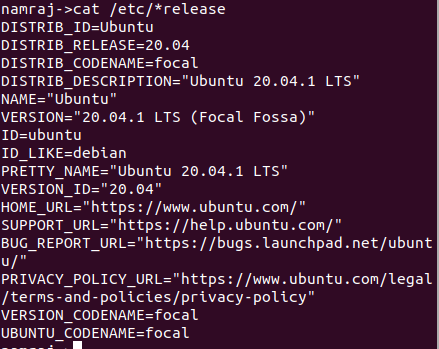
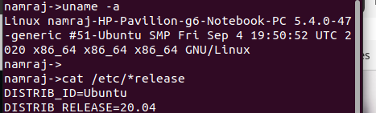
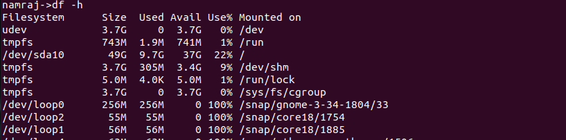
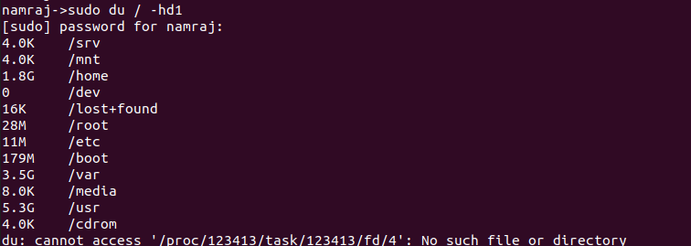
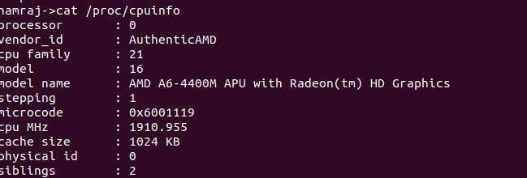
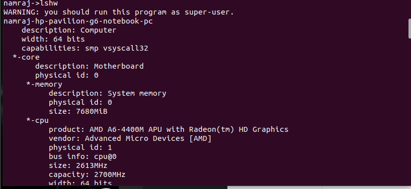
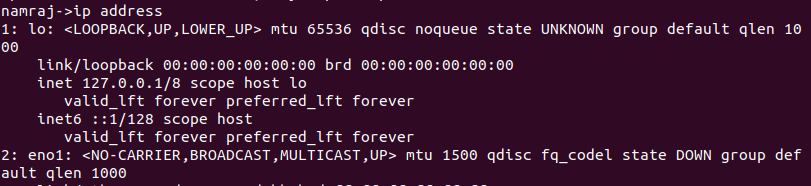

# Linux system Info
`tree`

`cat /etc/*release` Which distro  

`uname -a`  Which kernel 

`free -h`  Memory info

`df -h`  disk file system usage

`du / -hd1` disk usage Root - human Readable and one level deep

`cat /proc/cpuinfo`  Cpu information

`lshw` Hardware Information

`ip address` Shows the ip address

[Cli fundamentals](https://github.com/Namrajp/cli-fundamentals)
